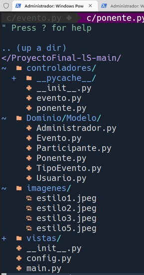
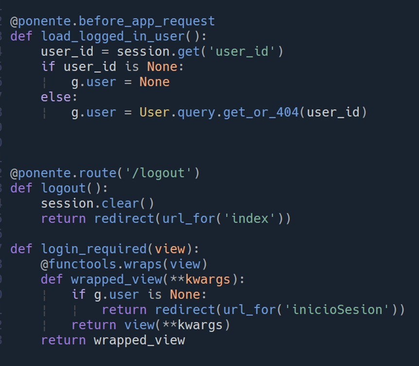
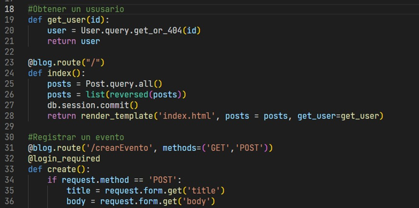
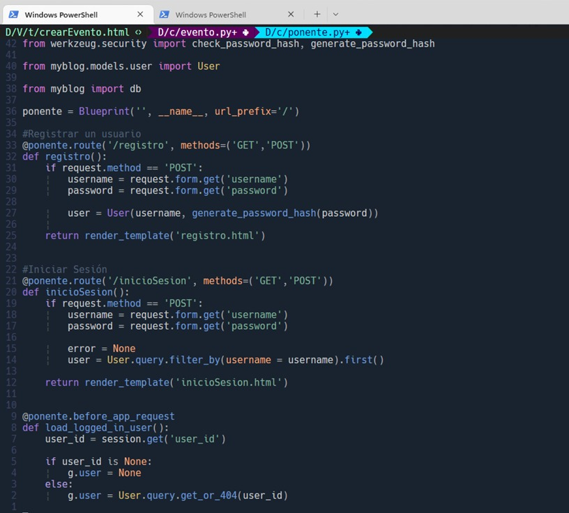
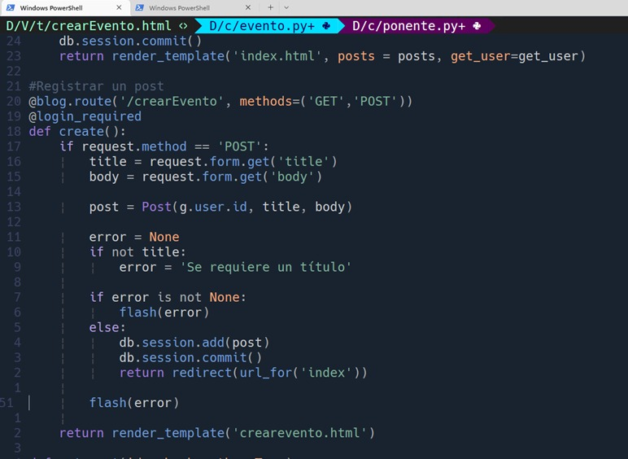
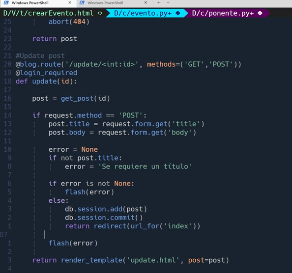

# ProyectoFinal-lS

# Estilos de programación
## Trinity
Se divide en modelo vista y controlador.

## 2. Code golf
Menor cantidad de líneas de código posibles.

# Codificación legible
## Limite la longitud de la línea.

Una buena práctica de legibilidad de código es tener un límite de líneas para no dificultar la lectura del programador, a la hora de analizar los algoritmos, como se observa en la imagen, tiene un límite de menos de 90 caracteres, por lo que hace ver al código parcialmente estrecho.

## 2. Sangría consistente
Se debe tener una buena sangría tanto para diferenciar qué línea de código está dentro de otra línea de código, como se puede apreciar en la imagen, hace que el código se vea más limpio y ordenado.

## 3. Evite el anidamiento profundo
No se debe tener anidamiento profundo, como se observa en esta parte del código, haciéndolo más entendible y legible.

## 4. Use nombres significativos para variables y funciones.
Esta es una muy buena práctica de codificación legible, ya que, como se tiene en esta fracción de código, hay tanto variables como funciones que dan mucho sentido al comportamiento que tiene el código en general
  

